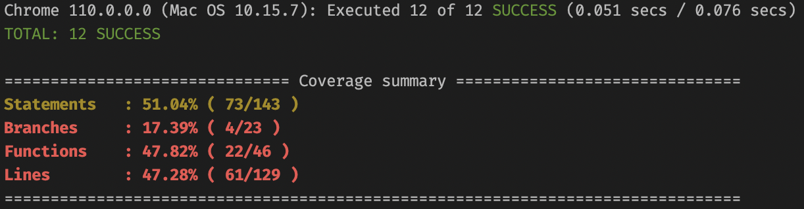

# Projet Docker

- [Technologies](#technologies)
- [Versioning](#versioning)
- [Fonctionnalités de l’application](#fonctionnalites-de-lapplication)
- [Contribuer](#contribuer)
  - [Linux ou MacOS](#linux-ou-macos)
  - [Windows](#windows)
- [Déploiement](#deploiement)

## Introduction

Le projet est une application web.<br/>
Il permet à un lecteur d’enregistrer les livres qu’il a lus dans une bibliothèque virtuelle.

## Technologies

- **Langages** :
  - front-end : HTML, Scss, TypeScript
  - back-end : PHP
- **Frameworks** :
  - front-end : Angular
  - back-end : Symfony
- **Base de données** :
  - SQL : PostgreSQL
- **Outils de développement** :
  - Versioning: Git
  - Conteneurisation : Docker

## Versioning

Concernant la convention de nommage des _commits_, la spécification "[conventional commits](https://www.conventionalcommits.org/en/v1.0.0/)" a été choisie, ainsi que l'anglais pour la langue.<br/><br/>

Au début du projet pour le processus Git, nous avons décidé de suivre le "Gitflow" avec des "pull requests" : il y a une branche de développement `dev` et une branche principale `main`.<br/>
Il n'est pas possible de pousser directement sur les branches `main` et `dev`.<br/>

- Le processus se déroule comme ceci :
  - le développeur crée des branches à partir de la branche de `dev`
  - le développeur fait une _pull request_ pour demander une revue de son travail à ses pairs
  - au moins une personne doit approuver la demande
  - le demandeur pourra fusionner ses branches sur la branche de développement
  - le chef d'équipe ou un développeur peut fusionner la branche de `dev` sur la branche `main`.<br/><br/>

Cela nous permet : de réduire les erreurs humaines, de nous corriger et de protéger notre produit final.

## Fonctionnalites de l’application

- Afficher ses livres
- Afficher les détails d’un livre
- Ajouter un livre
- Modifier un livre
- Supprimer un livre

## Contribuer

### Linux ou MacOS

Si vous utilisez un système _UNIX_, il suffira de lancer le script `run.sh` afin de démarrer l'application.<br>
Le script crée les images des applications _frontend_ et _backend_ à partir des fichiers `Dockerfile`.<br/>
Ensuite, il démarre les trois conteneurs de l'application _frontend_, _backend_ et la base de donnée _PostgreSQL_. L'application s'ouvre automatiquement sur [localhost:4200](http://localhost:4200).

### Windows

- Si vous utilisez un système `Windows` et si vous disposez d'un `WSL` installé, vous pouvez utiliser le script `run.sh` pour démarer les conteneurs de l'application.<br><br>
- Sinon dans un _powershell_ ou dans en ligne de commande, lancer les trois commandes suivantes :<br>

  - création de l'image backend : `docker build . -f backend/Dockerfile -t docker-backend`
  - création de l'image frontend : `docker build . -f frontend/Dockerfile -t docker-frontend`
  - lancement des conteneurs : `docker-compose up -d` <br><br>

- Pour arrêter les conteneurs, utilisez la commande : `docker-compose stop`.

## Deploiement

- Utilisez les fichiers _Dockerfile_ des dossiers `frontend` et `backend` pour créer les images de production de l'application :<br>
  - backend : `docker build . -f backend/Dockerfile -t docker-backend` <br>
  - frontend : `docker build . -f frontend/Dockerfile -t docker-frontend` <br>

NOTE : Afin d'effectuer les migrations, il est nécessaire de lancer le conteneur de la base de donnée avant celui du _backend_.

## Test logiciel

Pour lancer les tests unitaires, utiliser cette commande :

```
npm run test:local
```

Couverture des tests unitaires sur le _frontend_ :

